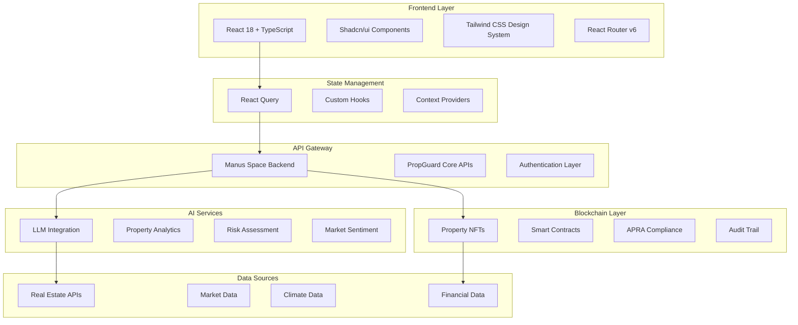
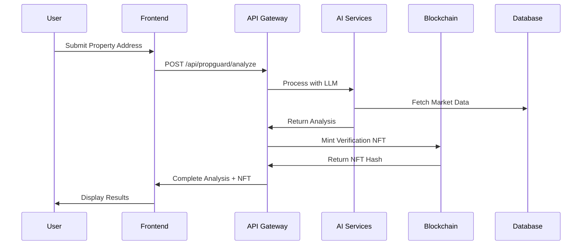

# PropGuard AI - Property Risk Assessment Platform

[](https://propguard-ai-openxai.lovable.app/)
[](https://9yhyi3c8nkjv.manus.space)
[](https://github.com/lucylow/global-ai-spark)
[]()
[]()
[]()
[]()

## 🎯 Overview

PropGuard AI is an enterprise-grade property risk assessment and valuation platform that leverages artificial intelligence, blockchain technology, and distributed computing to deliver comprehensive property analysis for financial institutions, lenders, investors, and regulatory compliance frameworks.

### 🏗️ Technical Architecture

The platform implements a microservices architecture with AI-driven analytics, ensuring scalability, reliability, and regulatory compliance across multiple jurisdictions.



## 🏗️ Technical Stack & Architecture

### Frontend Architecture
```typescript
// Core Technology Stack
const techStack = {
  framework: "React 18.3.1 + TypeScript 5.x",
  buildTool: "Vite 5.x (ESM, HMR, Tree-shaking)",
  styling: "Tailwind CSS 3.x + Shadcn/ui",
  stateManagement: "TanStack Query v5 + Context API",
  routing: "React Router v6 (Code-splitting)",
  bundleAnalysis: "Rollup Bundle Analyzer",
  performance: "React.lazy() + Suspense boundaries"
};
```

### Component Architecture
```typescript
// Component Hierarchy
interface ComponentArchitecture {
  pages: "Route-level components with lazy loading";
  layouts: "Shared layout components with context providers";
  features: "Business logic components with custom hooks";
  ui: "Reusable UI components (Shadcn/ui based)";
  common: "Shared utilities and higher-order components";
}

// Example: Advanced Property Analysis Hook
export const usePropertyAnalysis = () => {
  const { data, mutate, isLoading, error } = useMutation({
    mutationFn: (address: string) => 
      propGuardAPI.analyzeProperty(address),
    onSuccess: (data) => {
      // Cache optimization
      queryClient.setQueryData(['property', data.id], data);
      // Real-time updates
      eventEmitter.emit('property:analyzed', data);
    },
    retry: 3,
    retryDelay: (attemptIndex) => Math.min(1000 * 2 ** attemptIndex, 30000)
  });

  return { analyzeProperty: mutate, analysis: data, isLoading, error };
};
```

### Backend Microservices (Manus Space)
```typescript
// Service Architecture
interface BackendServices {
  apiGateway: "https://9yhyi3c8nkjv.manus.space/api";
  services: {
    propGuard: "Core property analysis engine";
    llmIntegration: "AI/ML processing pipeline"; 
    blockchain: "NFT minting and verification";
    xnode: "Distributed computing network";
    dataPipeline: "ETL and data processing";
  };
  protocols: ["REST API", "WebSocket", "GraphQL"];
  authentication: "JWT + OAuth 2.0";
  rateLimiting: "Redis-based token bucket";
}
```

### Data Flow Architecture


## 🚀 Features

### 🤖 AI-Powered Analysis
- **Property Valuation**: Real-time property value assessment
- **Risk Scoring**: Climate, market, and financial risk analysis
- **Sentiment Analysis**: Market sentiment and property sentiment scoring
- **Predictive Modeling**: Future value and risk projections

### ⛓️ Blockchain Integration
- **Property NFTs**: Immutable property certificates
- **APRA Compliance**: CPS 230 compliant reporting
- **Audit Trail**: Transparent transaction history
- **Smart Contracts**: Automated compliance checking

### 🌐 Distributed Computing (XNode)
- **Parallel Processing**: Distributed valuation calculations
- **Scalable Architecture**: Handle high-volume assessments
- **Real-time Updates**: Live market data integration
- **Global Network**: Decentralized computing nodes

### 📊 Risk Assessment
- **Climate Risk**: Flood, fire, coastal erosion analysis
- **Market Risk**: Volatility and trend analysis
- **Financial Risk**: LVR, DTI, and lending risk metrics
- **Compliance Risk**: Regulatory requirement checking

## 📁 Project Structure

```
src/
├── components/
│   ├── ui/                     # Shadcn UI components
│   ├── dashboard/              # Dashboard components
│   ├── blockchain/             # Blockchain features
│   ├── risk/                   # Risk analysis
│   ├── reports/                # Report generation
│   └── common/                 # Shared components
├── services/
│   ├── api/                    # API service layer
│   ├── auth/                   # Authentication
│   └── utils/                  # Utility functions
├── hooks/                      # Custom React hooks
├── types/                      # TypeScript definitions
├── config/                     # Configuration files
├── pages/                      # Page components
└── styles/                     # Styling files
```

## 🛠️ Installation & Setup

### Prerequisites
- Node.js 18+
- Bun (recommended) or npm

### Local Development
```bash
# Clone the repository
git clone https://github.com/lucylow/global-ai-spark.git
cd global-ai-spark

# Install dependencies
bun install

# Start development server
bun dev

# Build for production
bun run build
```

### Environment Variables
Create a `.env.local` file:
```env
VITE_API_BASE_URL=https://9yhyi3c8nkjv.manus.space/api
VITE_APP_NAME=PropGuard AI
VITE_ENABLE_BLOCKCHAIN=true
VITE_ENABLE_XNODE=true
```

## 📱 Usage

### Property Analysis
```typescript
import { usePropertyAnalysis } from '@/hooks/usePropertyAnalysis';

const { analyzeProperty, analysis, isLoading } = usePropertyAnalysis();

// Analyze a property
await analyzeProperty('123 Collins Street, Melbourne VIC');
```

### System Health Monitoring
```typescript
import { useSystemHealth } from '@/hooks/useSystemHealth';

const { health, getServiceStatus } = useSystemHealth();

// Check if all services are operational
const allHealthy = Object.values(health).every(service => 
  getServiceStatus(service) === 'online'
);
```

### API Integration
```typescript
import { propGuardAPI } from '@/services/api/propguard';

// Get property valuation
const analysis = await propGuardAPI.analyzeProperty('Value property in Sydney');

// Get market sentiment
const sentiment = await propGuardAPI.getMarketSentiment({ location: 'Sydney' });

// Mint property NFT
const nft = await propGuardAPI.mintPropertyNFT(propertyData, valuationData);
```

## 🔧 Advanced API Documentation

### Core PropGuard APIs
```typescript
// Property Analysis Endpoint
interface PropertyAnalysisRequest {
  command: string;
  location?: string;
  filters?: {
    priceRange?: [number, number];
    propertyType?: 'house' | 'apartment' | 'townhouse';
    bedrooms?: number;
  };
}

interface PropertyAnalysisResponse {
  id: string;
  property: {
    address: string;
    coordinates: [number, number];
    valuation: number;
    confidence: number;
  };
  risks: {
    climate: RiskScore;
    market: RiskScore;
    financial: RiskScore;
  };
  compliance: APRACompliance;
  nftHash?: string;
}

// Usage Example
const analysis = await fetch('/api/propguard/process-command', {
  method: 'POST',
  headers: { 'Content-Type': 'application/json' },
  body: JSON.stringify({
    command: 'Analyze property at 123 Collins Street Melbourne',
    filters: { priceRange: [500000, 1000000] }
  })
});
```

### LLM Integration APIs
```typescript
// Market Sentiment Analysis
interface MarketSentimentRequest {
  location: string;
  timeframe: '1M' | '3M' | '6M' | '1Y';
  dataPoints: Array<'price' | 'volume' | 'inventory' | 'days_on_market'>;
}

interface SentimentResponse {
  overall: 'bullish' | 'bearish' | 'neutral';
  confidence: number;
  factors: {
    economic: number;
    regulatory: number;
    market_dynamics: number;
  };
  predictions: {
    price_change_6m: number;
    market_stability: number;
  };
}

// Property Sentiment Analysis
const sentiment = await fetch('/api/llm/property-sentiment', {
  method: 'POST',
  body: JSON.stringify({
    propertyData: {
      address: '123 Collins Street',
      features: ['pool', 'garage', 'garden'],
      condition: 'excellent'
    }
  })
});
```

### Blockchain & NFT APIs
```typescript
// NFT Minting with APRA Compliance
interface NFTMintRequest {
  propertyData: PropertyData;
  valuationData: ValuationData;
  complianceChecks: {
    apra_cps230: boolean;
    basel_iii: boolean;
    nccp_act: boolean;
  };
}

interface NFTMintResponse {
  nftHash: string;
  tokenId: string;
  blockchainTxId: string;
  ipfsHash: string;
  complianceReport: APRAComplianceReport;
  auditTrail: AuditEntry[];
}

// Smart Contract Interaction
const nftResult = await fetch('/api/blockchain/mint-valuation-nft', {
  method: 'POST',
  headers: { 
    'Authorization': `Bearer ${jwt_token}`,
    'Content-Type': 'application/json'
  },
  body: JSON.stringify({
    propertyData: propertyAnalysis,
    complianceChecks: { apra_cps230: true }
  })
});
```

### XNode Distributed Computing
```typescript
// Distributed Risk Assessment
interface DistributedRiskRequest {
  properties: PropertyIdentifier[];
  riskTypes: Array<'climate' | 'market' | 'financial' | 'regulatory'>;
  computationNodes: number;
  priority: 'low' | 'medium' | 'high' | 'critical';
}

interface DistributedRiskResponse {
  jobId: string;
  status: 'queued' | 'processing' | 'completed' | 'failed';
  progress: number;
  results?: RiskAssessmentResult[];
  computationTime: number;
  nodesUsed: string[];
}

// Real-time Distributed Processing
const riskJob = await fetch('/api/xnode/distributed-risk-assessment', {
  method: 'POST',
  body: JSON.stringify({
    properties: propertyIds,
    riskTypes: ['climate', 'market'],
    computationNodes: 5,
    priority: 'high'
  })
});

// WebSocket for real-time updates
const ws = new WebSocket('wss://9yhyi3c8nkjv.manus.space/ws/xnode');
ws.onmessage = (event) => {
  const update = JSON.parse(event.data);
  if (update.jobId === riskJob.jobId) {
    console.log(`Progress: ${update.progress}%`);
  }
};
```

### Advanced Data Pipeline
```typescript
// Financial Impact Assessment
interface FinancialImpactRequest {
  scenarios: Array<{
    name: string;
    variables: {
      interest_rate_change?: number;
      property_value_change?: number;
      unemployment_rate?: number;
      inflation_rate?: number;
    };
  }>;
  portfolio: PropertyPortfolio;
  timeHorizon: number; // months
}

interface FinancialImpactResponse {
  scenarios: Array<{
    name: string;
    impact: {
      portfolio_value_change: number;
      default_probability: number;
      lvr_impact: number;
      capital_requirements: number;
    };
    stress_test_results: StressTestResult;
  }>;
  recommendations: string[];
  risk_mitigation: RiskMitigationStrategy[];
}
```

### Error Handling & Rate Limiting
```typescript
// Comprehensive Error Handling
interface APIError {
  code: string;
  message: string;
  details?: any;
  timestamp: string;
  requestId: string;
}

// Rate Limiting Headers
interface RateLimitHeaders {
  'X-RateLimit-Limit': string;      // Requests per hour
  'X-RateLimit-Remaining': string;  // Remaining requests
  'X-RateLimit-Reset': string;      // Reset timestamp
  'X-RateLimit-Retry-After': string; // Seconds to wait
}

// Retry Logic with Exponential Backoff
const apiClient = {
  async request(endpoint: string, options: RequestInit, retries = 3) {
    for (let i = 0; i <= retries; i++) {
      try {
        const response = await fetch(endpoint, options);
        
        if (response.status === 429) {
          const retryAfter = response.headers.get('X-RateLimit-Retry-After');
          await new Promise(resolve => 
            setTimeout(resolve, parseInt(retryAfter) * 1000)
          );
          continue;
        }
        
        return response;
      } catch (error) {
        if (i === retries) throw error;
        await new Promise(resolve => 
          setTimeout(resolve, Math.min(1000 * 2 ** i, 10000))
        );
      }
    }
  }
};
```

## 🏢 Compliance & Regulations

### APRA CPS 230 Compliance
- **Operational Resilience**: Continuous system monitoring
- **Critical Operations**: Risk assessment and valuation services
- **Service Provider Management**: Third-party API integration oversight
- **Incident Management**: Automated error detection and reporting

### NCCP Act Compliance
- **Responsible Lending**: Risk-based lending assessments
- **Borrower Verification**: Income and expense verification
- **Loan Suitability**: LVR and DTI ratio analysis

### Basel III Framework
- **Risk Weights**: Property risk scoring for capital requirements
- **Stress Testing**: Market volatility impact analysis
- **Capital Adequacy**: LVR ratio monitoring

## 🌍 Global Deployment

### Lovable Hosting
- **Primary**: https://propguard-ai-openxai.lovable.app/
- **Auto-deployment**: GitHub integration with instant updates
- **CDN**: Global content delivery for optimal performance

### Custom Domain Options
- Configure custom domains through Lovable project settings
- SSL certificates automatically provisioned
- DNS management for production deployments

## 🔐 Advanced Security Implementation

### Cryptographic Security
```typescript
// End-to-End Encryption
interface SecurityConfig {
  encryption: {
    algorithm: 'AES-256-GCM';
    keyDerivation: 'PBKDF2-SHA256';
    saltLength: 32;
    iterations: 100000;
  };
  transport: {
    tls: '1.3';
    hsts: true;
    certificatePinning: boolean;
    perfectForwardSecrecy: true;
  };
  authentication: {
    jwt: {
      algorithm: 'RS256';
      issuer: 'propguard-ai';
      expiration: '15m';
      refreshExpiration: '7d';
    };
    mfa: {
      enabled: true;
      providers: ['TOTP', 'SMS', 'Hardware'];
    };
  };
}

// Secure API Request
class SecureAPIClient {
  private async signRequest(payload: any, privateKey: string) {
    const signature = await crypto.subtle.sign(
      'RSASSA-PKCS1-v1_5',
      privateKey,
      new TextEncoder().encode(JSON.stringify(payload))
    );
    return btoa(String.fromCharCode(...new Uint8Array(signature)));
  }

  async secureRequest(endpoint: string, data: any) {
    const timestamp = Date.now();
    const nonce = crypto.randomUUID();
    const signature = await this.signRequest({ data, timestamp, nonce }, this.privateKey);
    
    return fetch(endpoint, {
      method: 'POST',
      headers: {
        'Authorization': `Bearer ${this.jwt}`,
        'X-Timestamp': timestamp.toString(),
        'X-Nonce': nonce,
        'X-Signature': signature,
        'Content-Type': 'application/json'
      },
      body: JSON.stringify(data)
    });
  }
}
```

### Zero-Trust Architecture
```typescript
// Access Control Matrix
interface AccessControlPolicy {
  resources: {
    'property:read': Permission[];
    'property:write': Permission[];
    'valuation:create': Permission[];
    'nft:mint': Permission[];
    'compliance:audit': Permission[];
  };
  roles: {
    'analyst': ('property:read' | 'valuation:create')[];
    'senior_analyst': ('property:read' | 'property:write' | 'valuation:create')[];
    'compliance_officer': ('property:read' | 'compliance:audit')[];
    'admin': ('property:read' | 'property:write' | 'valuation:create' | 'nft:mint' | 'compliance:audit')[];
  };
}

// Dynamic Permission Checking
const hasPermission = (user: User, resource: string, action: string): boolean => {
  const userPermissions = user.roles.flatMap(role => 
    accessControlPolicy.roles[role] || []
  );
  return userPermissions.includes(`${resource}:${action}`);
};
```

### Data Protection & Privacy
```typescript
// PII Data Encryption
class PIIProtection {
  private static encryptionKey = process.env.PII_ENCRYPTION_KEY;
  
  static async encryptPII(data: PersonalData): Promise<EncryptedData> {
    const iv = crypto.getRandomValues(new Uint8Array(16));
    const key = await crypto.subtle.importKey(
      'raw',
      new TextEncoder().encode(this.encryptionKey),
      'AES-GCM',
      false,
      ['encrypt']
    );
    
    const encrypted = await crypto.subtle.encrypt(
      { name: 'AES-GCM', iv },
      key,
      new TextEncoder().encode(JSON.stringify(data))
    );
    
    return {
      data: btoa(String.fromCharCode(...new Uint8Array(encrypted))),
      iv: btoa(String.fromCharCode(...iv)),
      algorithm: 'AES-GCM'
    };
  }
  
  static async decryptPII(encryptedData: EncryptedData): Promise<PersonalData> {
    // Decryption implementation with audit logging
  }
}

// GDPR Compliance
interface GDPRCompliance {
  dataProcessingLawfulness: 'consent' | 'contract' | 'legal_obligation' | 'legitimate_interest';
  dataRetentionPeriod: number; // days
  rightToErasure: boolean;
  rightToPortability: boolean;
  rightToRectification: boolean;
  dataProcessingAudit: AuditLog[];
}
```

### Blockchain Security
```typescript
// Smart Contract Security
interface SmartContractSecurity {
  accessControl: {
    onlyOwner: boolean;
    roleBasedAccess: boolean;
    multiSigRequired: boolean;
  };
  upgradability: {
    proxy: 'transparent' | 'uups';
    timelock: number; // seconds
    governanceRequired: boolean;
  };
  auditTrail: {
    immutableLogs: boolean;
    eventEmission: boolean;
    stateChanges: boolean;
  };
}

// NFT Verification
class NFTSecurityValidator {
  static async verifyNFTIntegrity(nftHash: string, propertyData: PropertyData): Promise<boolean> {
    const onChainData = await this.fetchFromBlockchain(nftHash);
    const expectedHash = await this.computePropertyHash(propertyData);
    
    return crypto.subtle.verify(
      'RSASSA-PKCS1-v1_5',
      this.publicKey,
      this.base64ToArrayBuffer(onChainData.signature),
      new TextEncoder().encode(expectedHash)
    );
  }
}
```

## 📈 Performance Optimization & Monitoring

### Advanced Performance Metrics
```typescript
// Performance Monitoring
class PerformanceMonitor {
  private static metrics = new Map<string, PerformanceMetric[]>();
  
  static startTransaction(name: string): PerformanceTransaction {
    return {
      name,
      startTime: performance.now(),
      marks: new Map(),
      end: function() {
        const duration = performance.now() - this.startTime;
        PerformanceMonitor.recordMetric(this.name, {
          duration,
          timestamp: Date.now(),
          marks: Array.from(this.marks.entries())
        });
        return duration;
      }
    };
  }
  
  static recordMetric(name: string, metric: PerformanceMetric) {
    if (!this.metrics.has(name)) {
      this.metrics.set(name, []);
    }
    this.metrics.get(name)!.push(metric);
    
    // Send to monitoring service
    this.sendToMonitoring(name, metric);
  }
}

// Usage in components
const PropertyAnalysis: React.FC = () => {
  const [analysis, setAnalysis] = useState(null);
  
  const analyzeProperty = async (address: string) => {
    const transaction = PerformanceMonitor.startTransaction('property_analysis');
    
    try {
      transaction.mark('api_call_start');
      const result = await propGuardAPI.analyzeProperty(address);
      transaction.mark('api_call_end');
      
      transaction.mark('rendering_start');
      setAnalysis(result);
      transaction.mark('rendering_end');
      
    } finally {
      transaction.end();
    }
  };
};
```

### Caching Strategy
```typescript
// Multi-Level Caching
interface CacheStrategy {
  levels: {
    memory: {
      implementation: 'Map' | 'LRU';
      maxSize: number;
      ttl: number;
    };
    localStorage: {
      prefix: string;
      encryption: boolean;
      compression: boolean;
    };
    serviceWorker: {
      strategies: ('cache-first' | 'network-first' | 'stale-while-revalidate')[];
      resources: string[];
    };
    cdn: {
      provider: 'CloudFlare' | 'AWS CloudFront';
      regions: string[];
      cacheHeaders: CacheHeaders;
    };
  };
}

class SmartCache {
  private static memoryCache = new Map();
  private static ttlCache = new Map();
  
  static async get<T>(key: string): Promise<T | null> {
    // 1. Check memory cache
    if (this.memoryCache.has(key)) {
      const { value, expiry } = this.memoryCache.get(key);
      if (Date.now() < expiry) return value;
      this.memoryCache.delete(key);
    }
    
    // 2. Check localStorage
    const localData = this.getFromLocalStorage(key);
    if (localData) {
      this.memoryCache.set(key, localData);
      return localData.value;
    }
    
    // 3. Check service worker cache
    const swData = await this.getFromServiceWorker(key);
    if (swData) {
      this.setInLocalStorage(key, swData);
      return swData;
    }
    
    return null;
  }
}
```

### Real-Time Monitoring Dashboard
```typescript
// System Health Monitoring
interface SystemHealthMetrics {
  api: {
    responseTime: number;
    errorRate: number;
    throughput: number;
    availability: number;
  };
  frontend: {
    loadTime: number;
    renderTime: number;
    memoryUsage: number;
    jsErrors: Error[];
  };
  blockchain: {
    gasPrice: number;
    blockTime: number;
    networkStatus: 'healthy' | 'congested' | 'offline';
    contractStatus: boolean;
  };
  xnode: {
    activeNodes: number;
    computationQueue: number;
    averageProcessingTime: number;
    networkLatency: number;
  };
}

// WebSocket Health Monitoring
class HealthMonitor {
  private ws: WebSocket;
  private healthData = new Subject<SystemHealthMetrics>();
  
  constructor() {
    this.ws = new WebSocket('wss://9yhyi3c8nkjv.manus.space/ws/health');
    this.ws.onmessage = (event) => {
      const healthUpdate = JSON.parse(event.data);
      this.healthData.next(healthUpdate);
    };
  }
  
  getHealthStream(): Observable<SystemHealthMetrics> {
    return this.healthData.asObservable();
  }
  
  async getDetailedHealthReport(): Promise<DetailedHealthReport> {
    return fetch('/api/health/detailed').then(r => r.json());
  }
}
```

### Load Testing & Stress Testing
```typescript
// Automated Performance Testing
interface LoadTestConfig {
  scenarios: {
    name: string;
    virtualUsers: number;
    duration: string;
    rampUp: string;
    endpoints: EndpointTest[];
  }[];
  thresholds: {
    http_req_duration: string;
    http_req_failed: string;
    checks: string;
  };
}

// Example load test
const loadTestConfig: LoadTestConfig = {
  scenarios: [
    {
      name: 'property_analysis_stress_test',
      virtualUsers: 100,
      duration: '5m',
      rampUp: '30s',
      endpoints: [
        {
          url: '/api/propguard/process-command',
          method: 'POST',
          weight: 70,
          body: '{"command": "Analyze property at ${address}"}',
          checks: ['status === 200', 'response.time < 2000']
        }
      ]
    }
  ],
  thresholds: {
    http_req_duration: 'p(95)<2000',
    http_req_failed: 'rate<0.01',
    checks: 'rate>0.99'
  }
};
```

## 🤝 Contributing

### Development Workflow
1. Fork the repository
2. Create a feature branch: `git checkout -b feature/new-feature`
3. Make changes and test thoroughly
4. Commit with conventional commits: `git commit -m "feat: add new feature"`
5. Push to branch: `git push origin feature/new-feature`
6. Create a Pull Request

### Code Standards
- **TypeScript**: Strict type checking enabled
- **ESLint**: Code quality and consistency
- **Prettier**: Automated code formatting
- **Conventional Commits**: Standardized commit messages

## 📞 Support

### Documentation
- **API Docs**: Available at `/docs` endpoint
- **Component Library**: Shadcn/ui documentation
- **Architecture Guide**: See `/docs/architecture.md`

### Contact
- **GitHub Issues**: https://github.com/lucylow/global-ai-spark/issues
- **Live Demo**: https://propguard-ai-openxai.lovable.app/
- **Backend API**: https://9yhyi3c8nkjv.manus.space

## 📄 License

This project is licensed under the MIT License - see the [LICENSE](LICENSE) file for details.

## 🏆 Achievements

- ✅ **APRA CPS 230 Compliant** - Operational resilience framework
- ✅ **AI-Powered Analytics** - Advanced machine learning integration
- ✅ **Blockchain Certified** - Immutable property records
- ✅ **Distributed Architecture** - Scalable XNode computing
- ✅ **Real-time Processing** - Instant property analysis

---

**PropGuard AI** - Revolutionizing property assessment through artificial intelligence, blockchain technology, and distributed computing.


